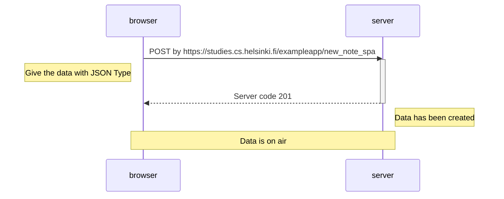

# New Note in the Single Page App Diagram

```mermaid

sequenceDiagram
    participant browser
    participant server

    browser->>server: POST by https://studies.cs.helsinki.fi/exampleapp/new_note_spa
    activate server
    Note left of browser: Give the data with JSON Type
    server-->>browser: Server code 201
    deactivate server
    Note right of server: Data has been created 
    
    Note over browser,server: Data is on air

```
